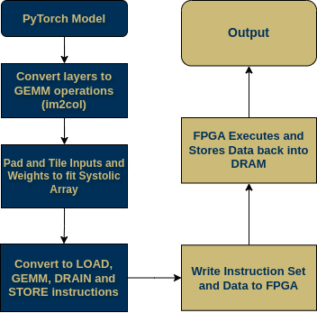
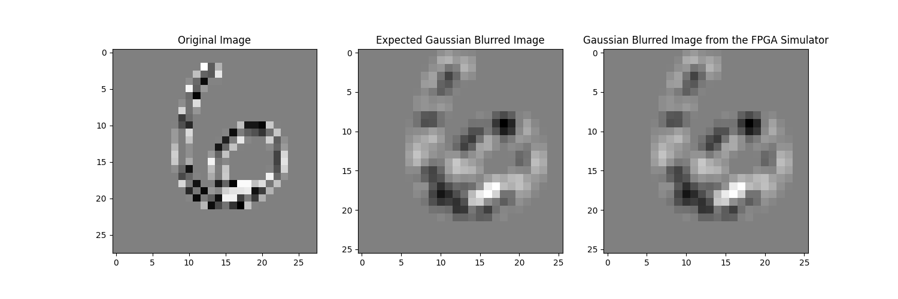
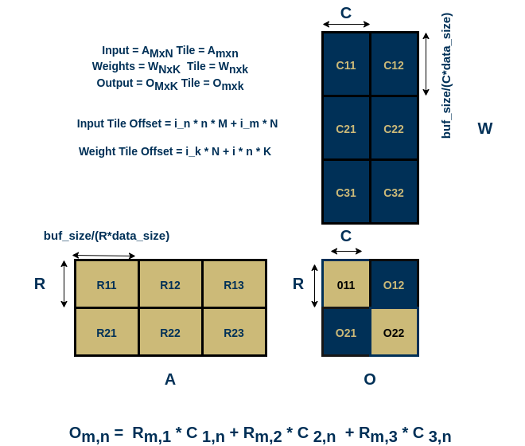
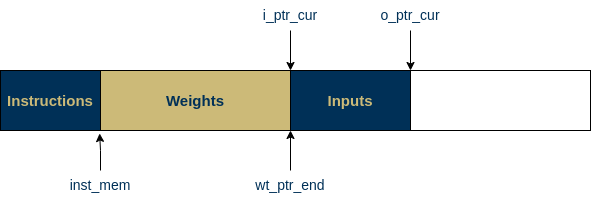

# End-to-End Framework and Simulator for Systolic Array
This repo contains code for a compiler for a custom systolic array hardware, along with a simulator to verify correctness of the generated instructions





## Running the Code
An example on how to run the code is given in `gemm_op/run_sim.py` and with convolutions in `gemm_op/im2col.py`

To run an example:
```
cd compiler/gemm_op
python3 run_sim.py
```


# Compiler - PyTorch Model to GEMM operation Conversion for a Dense Systolic Array
The compiler takes in a Pytorch model as input, and breaks the model down into 
GEMM operations that fit into the Systolic array buffers. The tiling is done as follows:


Due to the way the systolic array is addressed, the inputs are loaded in columnwise, while the weights rowwise. For ease of loading, inputs are stored as the transpose. The outputs are stored back into memory in transpose to ensure inter-layer compatibility.

The compiler also creates a DRAM memory dump with the weights for all layer on one side and the first layer inputs on the other 



It has built-in support for multiple layers, with the output of the previous layer acting as the input for the next. 

Currently, the output is two text files: `data_list.txt` with the data, and `instruction_list.txt` with the instructions

## Simulator
A rudimentary simulator has been written to ensure the correctness of the memory map and the instructions generated. It abstracts the DRAM and the buffers as 1D arrays, and executes LOAD, STORE, GEMM and DRAIN commands analogous to hardware. 

## Possible improvements
Activation functions and Layer Normalisation is not implemented as hardware support for them are not available.

# Hardware -  Dense Systolic Array (SA) for an End-to-end ML Accelerator Framework
The major components in this project include:


*  PE Grid (Datapath): Consists of all the MAC units that perform the GEMM operation on input data streams received from neighboring PEs (left and top) through ports in Output Stationary dataflow. 

* Controller: Manages the state transitions and flow of data through the systolic array.

* SRAM Banks: Three SRAM buffers for storing inputs,
weights, and outputs. Each PE continuously computes
and accumulates its output value, which is immediately
stored in the down buffer and remains stationary
for the duration of the computation.
    – The left buffer stores the input activation values
that flow horizontally across the systolic array.
This data feeds into the leftmost column of processing
elements (PEs) and moves to the right across
each row.
    – The top buffer holds the input weight values that
flow and accumulate vertically through the systolic
array. This data is provided to the topmost
row of PEs and travels downward through each
column.
    – As data flows through the systolic array (activations
from left to right and weights from top to
bottom), each PE multiplies its current input activation
with the current weight and accumulates
the result into its output value. The output value
is then held stationary in the down buffer.

* Instruction Reader: The instruction reader implements
a state machine to control the execution flow based
on the current opcode and internal state variables. It extracts
opcode, buffer ID, and memory location from the memory
snapshot (compiler output). Based on the opcode, the module
executes different operations such as loading data into
buffers (opcode_LD), performing matrix multiplication (opcode_
GEMM), or draining data from the systolic array (opcode_
DRAINSYS). 

* Wrapper (testbench): systolic_array_tb wraps around the systolic array
top module which provides the necessary data
and control signals while observing the output data.
More importantly, the wrapper acts as a state machine
for the unit, where each instruction corresponds to a
controller state and is set by the wrapper accordingly.

**NOTE:** The sizes of all the elements in the datapath (PE grid dimensions, SRAM buffer size, data width) are parameterized.
To simulate this code (tested on ModelSim), use systolic_array_tb.v as the testbench, and store the instructions and data from the compiler in instruction_list.txt and data_list.txt respectively. Results and inputs are dumped to output_buf.txt for further use. 

* FPGA Synthesis Results: 212 ALMs,344 ALUTs, 204
registers
* Fastest Clock (Intel DE10): 180 MHz across 4 TV corners

# License

```

Licensed under the Apache License, Version 2.0 (the "License");
Copyright 2023 Paul Cucchiara, Nikhil Praveen, Spandan More, Anirudh Tulasi, Adithi S Upadhya
you may not use this file except in compliance with the License.
You may obtain a copy of the License at

    http://www.apache.org/licenses/LICENSE-2.0

Unless required by applicable law or agreed to in writing, software
distributed under the License is distributed on an "AS IS" BASIS,
WITHOUT WARRANTIES OR CONDITIONS OF ANY KIND, either express or implied.
See the License for the specific language governing permissions and
limitations under the License.
```

## Maintained By
Nikhil Praveen (np97@gatech.edu)
Paul Cucchiara (pcucchiara3@gatech.edu)
Spandan More (smore39@gatech.edu)
Adithi S Upadhaya (aupadhaya8@gatech.edu)
Anirudh Tulasi (atulasi3@gatech.edu)
