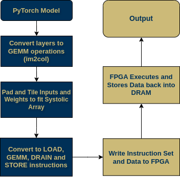
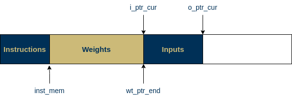

# Compiler Framework and Simulator for Systolic Array
This repo contains code for a compiler for a custom systolic array hardware, along with a simulator to verify correctness of the generated instructions




## Running the Code
An example on how to run the code is given in `gemm_op/run_sim.py` and with convolutions in `gemm_op/im2col.py`

To run an example:
```
cd gemm_op
python3 run_sim.py
```


## Compiler
The compiler takes in a Pytorch model as input, and breaks the model down into 
GEMM operations that fit into the Systolic array buffers. The tiling is done as follows:


Due to the way the systolic array is addressed, the inputs are loaded in columnwise, while the weights rowwise. For ease of loading, inputs are stored as the transpose. The outputs are stored back into memory in transpose to ensure inter-layer compatibility.

The compiler also creates a DRAM memory dump with the weights for all layer on one side and the first layer inputs on the other 



It has built-in support for multiple layers, with the output of the previous layer acting as the input for the next. 

Currently, the output is two text files: `data_list.txt` with the data, and `instruction_list.txt` with the instructions

## Simulator
A rudimentary simulator has been written to ensure the correctness of the memory map and the instructions generated. It abstracts the DRAM and the buffers as 1D arrays, and executes LOAD, STORE, GEMM and DRAIN commands analogous to hardware. 

## Possible improvements
Activation functions and Layer Normalisation is not implemented as hardware support for them are not available.

## License

```
Copyright 2023 Paul Cucchiara, Nikhil Praveen

Licensed under the Apache License, Version 2.0 (the "License");
you may not use this file except in compliance with the License.
You may obtain a copy of the License at

    http://www.apache.org/licenses/LICENSE-2.0

Unless required by applicable law or agreed to in writing, software
distributed under the License is distributed on an "AS IS" BASIS,
WITHOUT WARRANTIES OR CONDITIONS OF ANY KIND, either express or implied.
See the License for the specific language governing permissions and
limitations under the License.
```

## Maintained By
Nikhil Praveen (np97@gatech.edu)
Paul Cucchiara (pcucchiara3@gatech.edu)
